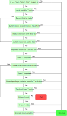

# [The Haxe Manual](https://haxe.org/manual)

[](https://travis-ci.org/HaxeFoundation/HaxeManual)

## Contributions / Information for authors

##### For contributions please edit the `.md` files in [`content/`](content/).

The manual is separated into chapters. Each chapter resides in its own `.md` file. The syntax is Markdown for the most part, with some special comments mixed in.

## Markdown syntax

Standard syntax can be used freely (and in moderation).

### Sections and labels

On https://haxe.org/manual, the manual is separated into individual pages. Each page has its own URL and represents a **section**. Every section has a title and a label. For backward compatibility and flexibility in titles, the label of a section is not directly based on its title.

As an example, the ["Property" section](https://haxe.org/manual/class-field-property.html) has the label `class-field-property` (which you can see in its URL).

##### To give a section a label:

```markdown
<!--label:here-is-the-label-->
## Here is the title
```

The nesting level of a section depends on the heading level (number of `#` characters in the title):

 - `##` denotes a chapter, only one per `.md` file
 - `###` denotes a section
 - `####` denotes a subsection
 - `#####` denotes a paragraph (when used without the label tag) or a subsubsection (when used with a label tag)

### Links to sections

To reference another section, use the regular Markdown link syntax with the label in place of the URL.

##### To reference a section:

```markdown
Please see the [hello world](introduction-hello-world) section.
```

### Haxe code assets (CI-tested)

The Haxe files in the [`assets/`](assets/) directory form the majority of the Haxe code samples that are included in the manual. All of these files are automatically tested with Travis CI for all Haxe targets. For the testing procedures and rules, see `tests/RunTravis.hx`.

On haxe.org, the code samples can be seen included in the sections for a comfortable reading experience. In the `.md` sources, however, the Haxe files are only referenced with a link to avoid code duplication.

When creating new code assets, please make sure to use [`haxe-formatter`](https://github.com/HaxeCheckstyle/haxe-formatter/) on the file before committing it. The configuration file `hxformat.json` is provided in the repository.

##### To include a Haxe code asset:

```markdown
[code asset](assets/HelloWorld.hx)
```

The above needs to be on its own line. The `code asset` text cannot be changed (it is not displayed to the reader anyway).

##### To include a smaller part of a Haxe code asset:

```markdown
[code asset](assets/HelloWorld.hx#L2-L4)
```

The above would only show lines 2 through 4 (inclusive).

### Code assets (direct)

Code can also be included in the Markdown content directly. This is convenient for very short snippets, snippets in other languages, or code that is not correct. Where possible, however, please use the CI-tested variant described above.

##### To include a snippet of Haxe code:

<pre><code>```haxe
trace("Hello, world!");
```
</pre></code>

##### To include a snippet of another language:

<pre><code>```js
console.log("Hello, world!");
```
</pre></code>

### Code (inline)

Finally, short expressions can be included directly in the text by surrounding the code with backticks.

### Flowcharts

Flowcharts are included as svg images:

```markdown

```

### Version information

##### To indicate that the following information is only true starting from a given Haxe version:

```markdown
##### since Haxe 4.0.0
```

### Definition

##### To give a concise definition of a term:

```
> ##### Define: Some Term
>
> This is the definition of the term.
>
> It can span multiple lines and use other Markdown syntax, too.
```

Definitions can be referenced from other parts of the manual. Their label is based on the term they describe, e.g. `define-some-term` for the example above.

### Trivia

##### To give additional information, not crucial to understanding Haxe:

```
> ##### Trivia: Some Factoid
>
> This is something that is not very important.
```

## Metadata and defines lists

The [metadata](https://haxe.org/manual/cr-metadata.html) and [define](https://haxe.org/manual/compiler-usage-flags.html) tables are generated automatically from [JSON definitions](https://github.com/HaxeFoundation/haxe/tree/development/src-json). To update the generated files from the current `development` branch, simply run `haxe generate.hxml` in the `generate` directory (requires `curl` to be installed and in `PATH`).

## Manual preview

When working on the manual, any Markdown preview (including GitHub renderer) should suffice to show if the text looks correct. To make sure the special Haxe Manual-specific syntax works as expected, please use a local instance of [haxe.org](https://github.com/HaxeFoundation/haxe.org). The workflow consists of:

 1. Clone the `haxe.org` and `HaxeManual` repositories
 2. Replace the `manual` directory in `haxe.org` with a symlink to your local copy of `HaxeManual`
 3. Start the haxe.org server (`haxe start-server.hxml &` in the `haxe.org` repository)
 4. Make changes to the `.md` files
 5. Run `haxe generate.hxml` in the `haxe.org` repository
 6. Check results on `localhost:2000`, repeat from step 4

You can disable all `haxe.org` generators except the manual generator in `Main.hx` to hasten the generation process. A significant speed-up can also be gained by turning off the syntax highlighting.
