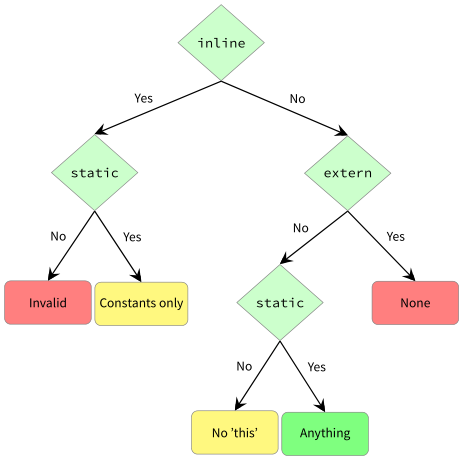

## 4.1 Variable

We have already seen variable fields in several code examples of previous sections. Variable fields hold values, a characteristic which they share with most (but not all) properties:

```haxe
class VariableField {
  static var member:String = "bar";

  public static function main() {
    trace(member);
    member = "foo";
    trace(member);
  }
}
```
We can learn from this that a variable

1. has a name (here: `member`),
2. has a type (here: `String`),
3. may have a constant initialization (here: `"bar"`) and
4. may have [access modifiers](class-field-access-modifier.md) (here: `static`)

The example first prints the initialization value of `member`, then sets it to `"foo"` before printing its new value. The effect of access modifiers is shared by all three class field kinds and explained in a separate section.

It should be noted that the explicit type is not required if there is an initialization value. The compiler will [infer](type-system-type-inference.md) it in this case.



_Figure: Initialization values of a variable field._

---

Previous section: [Class Fields](class-field.md)

Next section: [Property](class-field-property.md)