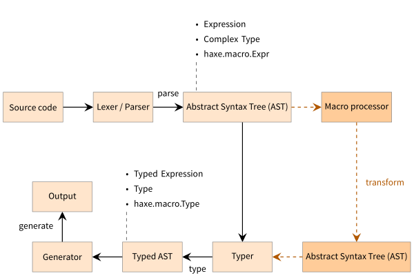

## 9 Macros

Macros are without a doubt the most advanced feature in Haxe. They are often perceived as dark magic that only a select few are capable of mastering, yet there is nothing magical (and certainly nothing dark) about them.

> ##### Define: Abstract Syntax Tree (AST)
>
> The AST is the result of **parsing** Haxe code into a typed structure. This structure is exposed to macros through the types defined in the file `haxe/macro/Expr.hx` of the Haxe Standard Library.

_Figure: The role of macros during compilation._

A basic macro is a **syntax-transformation**. It receives zero or more [expressions](expression.md) and also returns an expression. If a macro is called, it effectively inserts code at the place it was called from. In that respect, it could be compared to a preprocessor like `#define` in C++, but a Haxe macro is not a textual replacement tool.

We can identify different kinds of macros, which are run at specific compilation stages:

* Initialization Macros: These are provided by command line using the `--macro` compiler parameter. They are executed after the compiler arguments were processed and the **typer context** has been created, but before any typing was done (see [Initialization macros](macro-initialization.md)).
* Build Macros: These are defined for classes, enums and abstracts through the `@:build` or `@:autoBuild` [metadata](lf-metadata.md). They are executed per-type, after the type has been set up (including its relation to other types, such as inheritance for classes) but before its fields are typed (see [Type Building](macro-type-building.md)).
* Expression Macros: These are normal functions which are executed as soon as they are typed.

---

Previous section: [RTTI structure](cr-rtti-structure.md)

Next section: [Macro Context](macro-context.md)